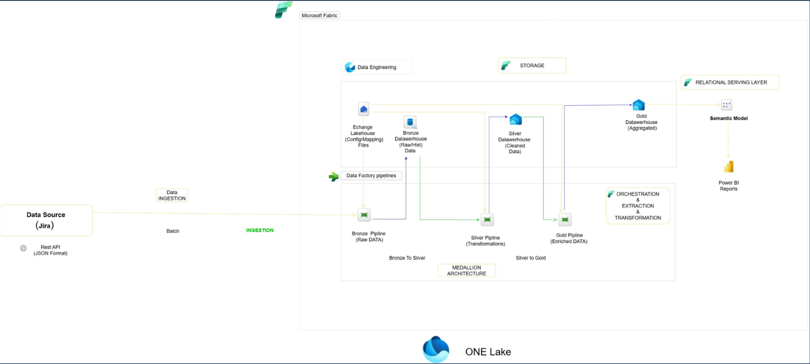
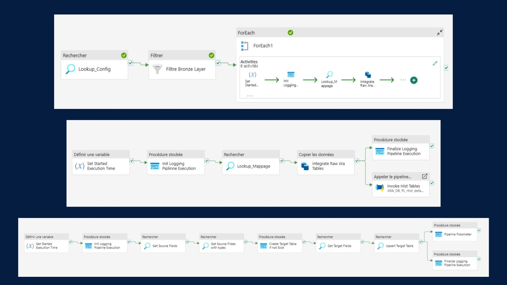
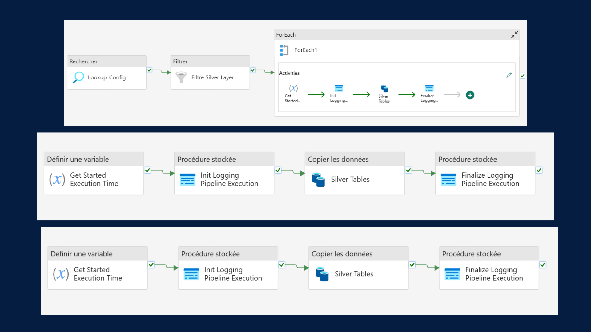
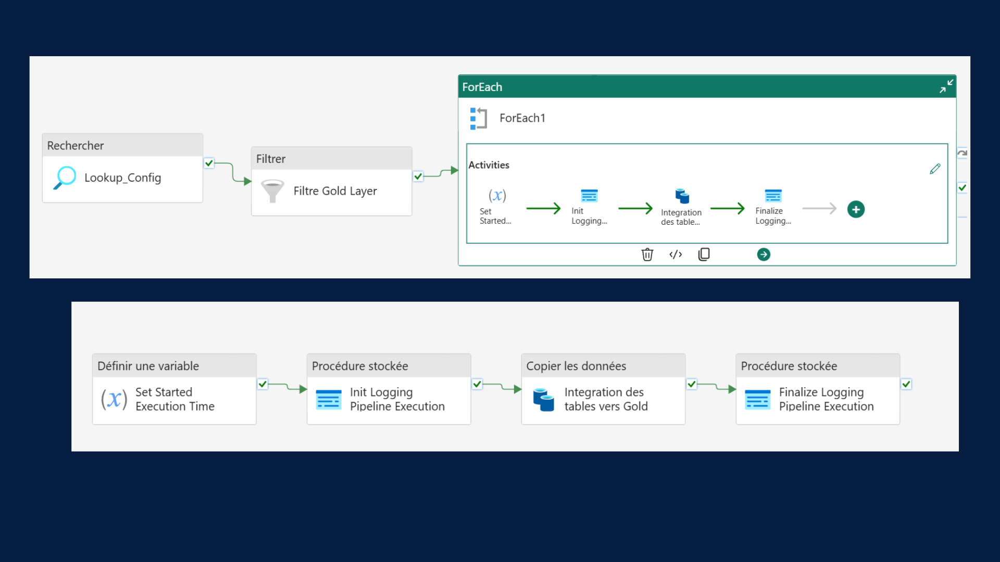

# Jira Data Analysis (Batch Mode)

## 📑 Table of Contents
1. [Project Overview](#project-overview)  
2. [Architecture](#architecture)  
3. [Implementation](#implementation)  
   - [Bronze Layer](#bronze-layer)  
   - [Silver Layer](#silver-layer)  
   - [Gold Layer](#gold-layer)  
4. [Challenges & Improvements](#challenges--improvements)  
5. [Tools & Technologies](#tools--technologies)  
6. [Project Presentation](#project-presentation)

---

## 🚀 Project Overview
This project focuses on **analyzing Jira data** by building a data pipeline using **Microsoft Fabric**.  
The solution integrates Jira data via REST API in **batch mode (JSON)** and processes it into a structured data warehouse following the **Medallion Architecture** (Bronze, Silver, Gold layers).  

Main objectives:
- Ingest raw Jira data (Issues, Changelogs, Components) into a **SQL Database (Bronze Layer)**.  
- Clean, transform, and organize data into **Fact and Dimension tables (Silver Layer)**.  
- Enrich, aggregate, and model data for **business insights and Power BI reporting (Gold Layer)**.  

---

## 🏗 Architecture
The pipeline architecture follows the **Medallion Architecture** inside **Microsoft Fabric**.

---

## ⚙️ Implementation

### 🔹 Bronze Layer
- Ingest Jira data via REST API in **batch mode**.  
- Store raw JSON data in a **SQL Database**.  
- Orchestrated pipelines with:
  - Initial ingestion  
  - `ForEach` activities  
  - Historical tables loading  

---

### 🔹 Silver Layer
- Transform and clean raw data.  
- Create **Fact and Dimension tables**.  
- Store results in **Fabric Data Warehouse**.  
- Orchestrated pipelines for iterative transformations.  

---

### 🔹 Gold Layer
- Aggregate and enrich data.  
- Apply semantic modeling for **Power BI dashboards**.  
- Data prepared for **end-user analytics and visualization**.  

---

## 🛠 Challenges & Improvements
### Challenges
- Handling **dynamic mappings** for different Jira tables.  
- Managing **different endpoints** across Jira APIs.  
- **Pagination issues** in Jira REST API.  
- Extracting and structuring **changelogs** data.  

### Improvements
- Automated changelog extraction.  
- Automatic pipeline retries in case of failure.  
- **AES security** for sensitive data.  

---

## 🧰 Tools & Technologies
- **Jira** (data source via REST API)  
- **Microsoft Fabric**  
  - Data Factory Pipelines  
  - Data Warehouse (SQL Analytics Endpoint)  
- **Power BI** (dashboards & visualization)  
- **SQL** (data transformation & modeling)  

---

## 🎯 Project Presentation
For a detailed presentation, please check:  
📄 [Project Slides (PDF)](./Copie_de_Blue_Professional_Business_Project_Presentation.pdf)

---
